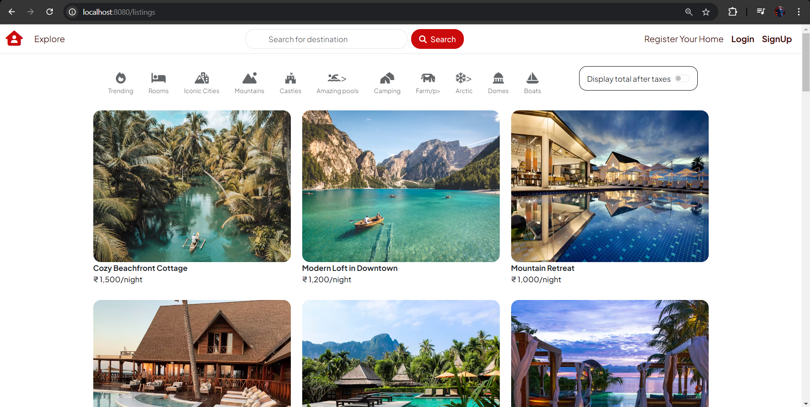
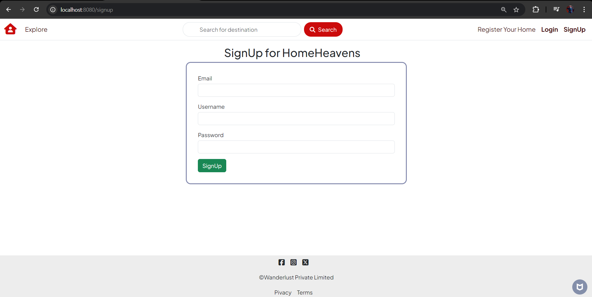
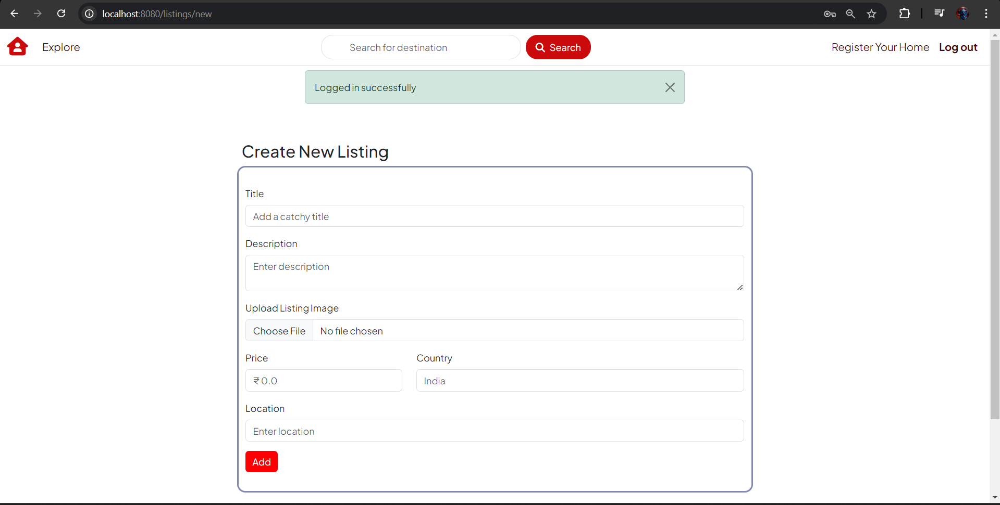
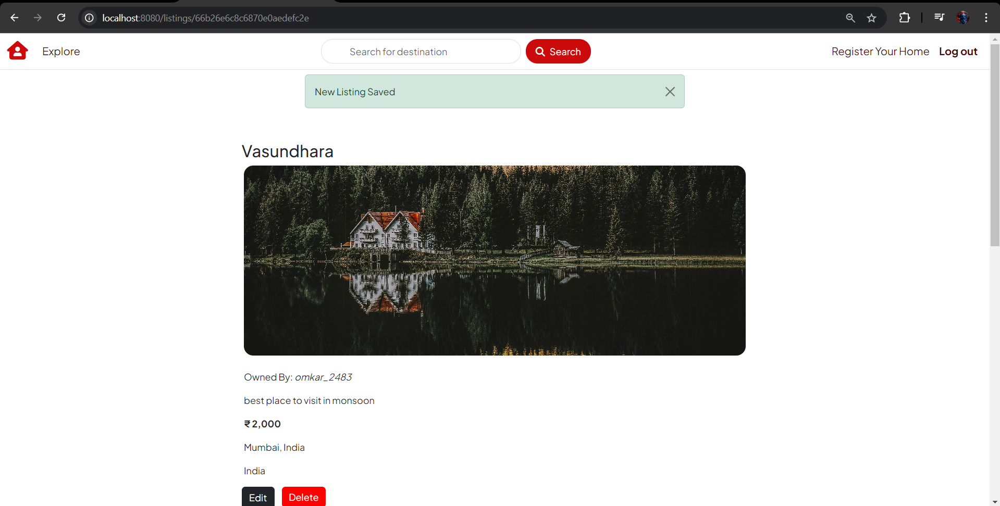
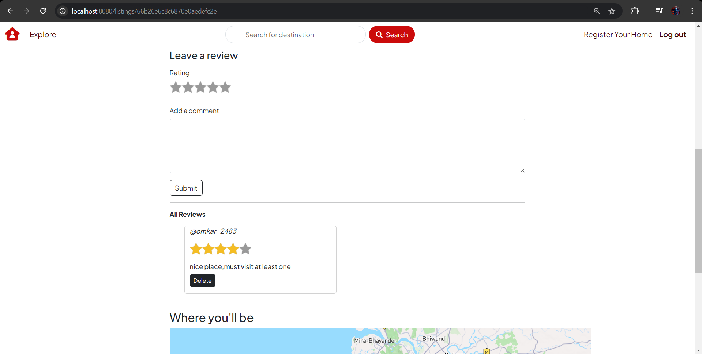
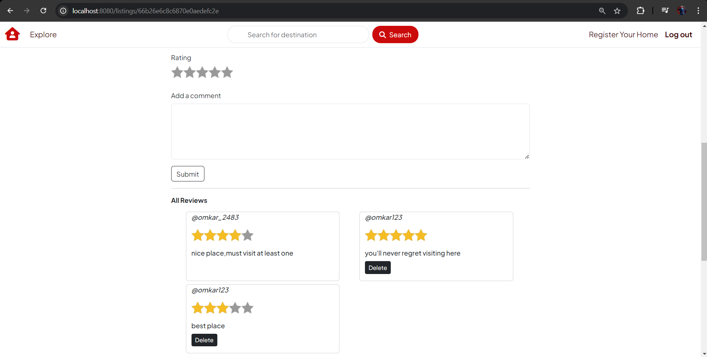
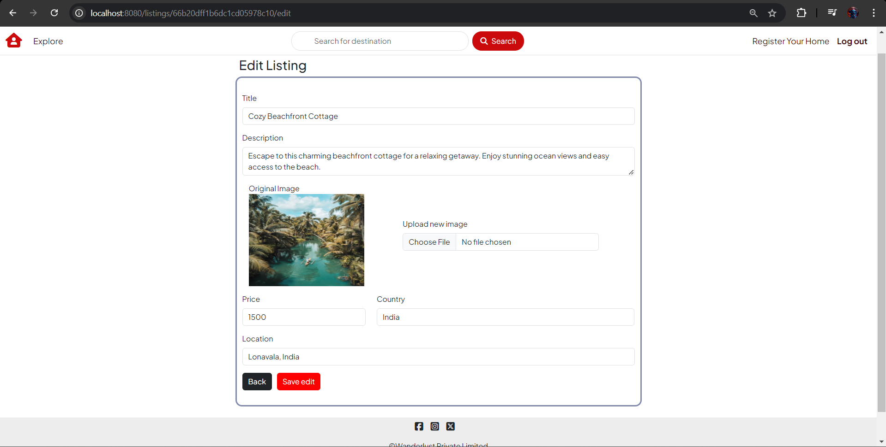

# HomeHeavens
HomeHeavens is a web application designed to manage and showcase property listings. It leverages MongoDB, Express, Node.js, and various other technologies to provide a seamless user experience for property owners and potential buyers. The application follows the MVC architecture and includes robust authentication, image storage, map features, and validation mechanisms.

# UI
* home page

* register your home

* authentication and authorization- only owner can edit/ delete listing

* MongoDB database- homeheavens
# Models-store All models used in project
   * Model 1- Listing 
   1. title
   2. description
   3. image
   4. price
   5. location
   6. country
   7. reviews
   8. owner
   9. geometry
   
   * Listing-Review => One to Many Relation, reviews refer to Review
   add one more key in listing for reviews, which store ObjectId of its all reviews.
   * Listing-User => One to One Relation, owner refers to User 

   * Model 2- Review
   1. comment 
   2. rating
   3. createdAt 
   4. author
   * Review-User => One to One Relation, author refers to User 

   Model-3- User
   1. email
   2. username
   3. password
   we just define schema with email. username and password will be added by passport-local-mongoose

# init - to initialize the database and website
   * init data is stored in data.js
   * run index.js to initialize/re-initialize database

# Views - contain all templates
   * layouts have boilerplate for common includes
   * listing have all pages related to listings

# Public - Static files
   * all static files are stored in public folder 

# utils - extra files
   * extra utility files like error handler ect are stored in util folder 

# Validations
   * for client side validation, we set required in input field and applied bootstrap class 'needs-validation', the logic of 'needs-validation' is written in "public/js/script.js" 
   * we used "joi" tool for server side schema validation in schema.js

# routes 
   * all routes are stored in respective route files

# authentication and authorization
   * passport: Passport is Express-compatible authentication middleware for Node.js.
   * passport-local: Passport strategy for authenticating with a username and password.
   * passport-local-mongoose: Passport-Local Mongoose is a Mongoose plugin that simplifies building username and password login with Passport.

# Controller
   * callback functions used for routes are defined in controller

# phase-III
   * implemented MVC model
   * router.route used to combine routes of common path
   * starability module used to style rating
   * images stored on cloudinary using multer-storage-cloudinary and cloudinary
   * map feature using mapbox api
   * geocoding for getting coordinates of location
   * coordinates are stored in database using GeoJSON 